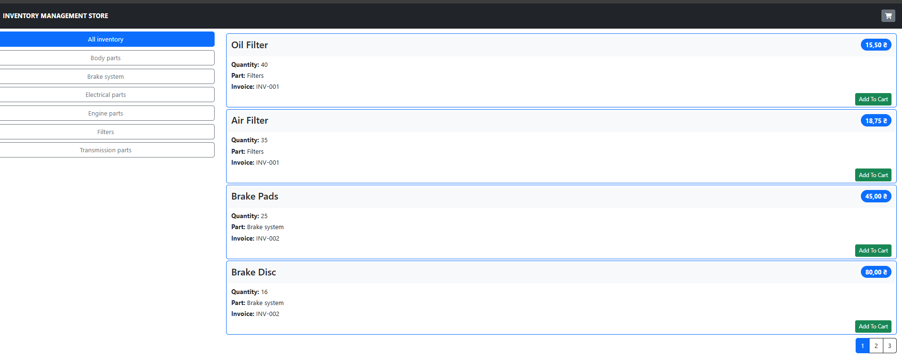
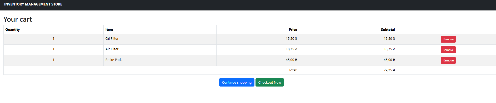
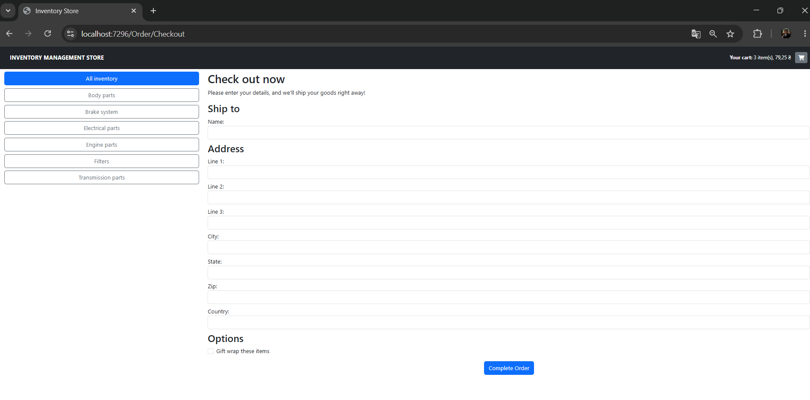
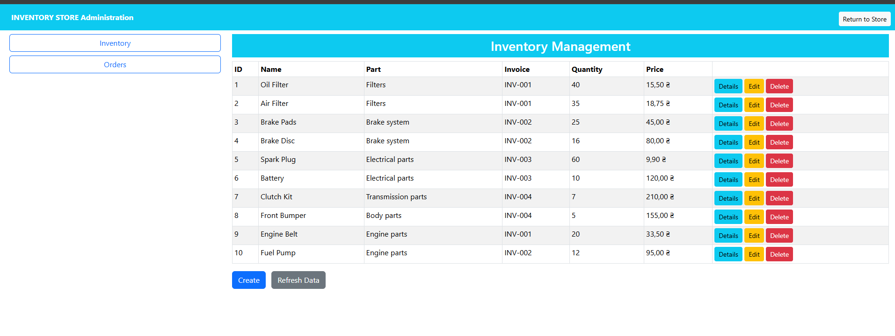
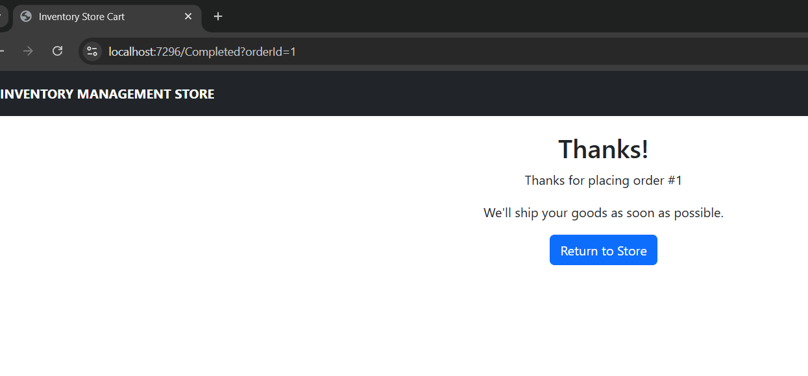

<div align="center">

# Inventory Management Store


<p>
  
  
  
  
  
</p>

<p>
  <b>A full-stack inventory management web application built with ASP.NET Core, Entity Framework Core, Razor Pages, and Blazor Server.</b>
</p>

</div>

---

## Overview

**Inventory Management Store** is a full-stack web application for managing inventory items, browsing products by categories, working with a shopping cart, placing customer orders, and administrating inventory and order data through an interactive dashboard.

The application combines several ASP.NET Core approaches in one project.

- **ASP.NET Core MVC** for the public store catalog
- **Entity Framework Core** for database access
- **Razor Pages** for cart and order completion pages
- **Blazor Server** for the admin dashboard
- **SQL Server LocalDB** for data storage
- **Bootstrap** for responsive UI styling

---

## Features

### Storefront

- Inventory catalog with item cards
- Category filtering based on inventory parts
- Pagination for catalog browsing
- Product price, quantity, part category, and invoice display
- Shopping cart with session-based storage
- Add and remove items from the cart
- Cart total calculation
- Checkout form with server-side validation
- Order completion page after successful checkout

### Admin Dashboard

- Blazor Server admin panel
- Inventory table with live data from SQL Server
- Create, read, update, and delete inventory items
- Detailed inventory item view
- Form validation with DataAnnotations
- Order administration
- Separate shipped and unshipped order lists
- Ability to mark orders as shipped
- Ability to reset shipped orders back to unshipped

---

## Tech Stack

| Layer | Technology |
|---|---|
| Backend | ASP.NET Core |
| Architecture | MVC, Razor Pages, Blazor Server |
| ORM | Entity Framework Core |
| Database | SQL Server LocalDB |
| UI | Bootstrap, Razor, Blazor Components |
| Language | C# |
| IDE | Visual Studio 2022 |

---

## Screenshots

### Store Catalog



### Shopping Cart



### Checkout Flow



### Admin Inventory Dashboard



### Completed Order Page



---

## Application Structure

```text
Inventory Management Store
│
├── Components
│   ├── CartSummaryViewComponent.cs
│   └── NavigationMenuViewComponent.cs
│
├── Controllers
│   ├── HomeController.cs
│   └── OrderController.cs
│
├── Infrastructure
│   ├── PageLinkTagHelper.cs
│   ├── SessionExtensions.cs
│   └── UrlExtensions.cs
│
├── Models
│   ├── Cart.cs
│   ├── SessionCart.cs
│   ├── Inventory.cs
│   ├── Part.cs
│   ├── Invoice.cs
│   ├── Operation.cs
│   ├── InventoryOperation.cs
│   ├── Order.cs
│   ├── OrderLine.cs
│   ├── StoreDbContext.cs
│   ├── EFStoreRepository.cs
│   └── EFOrderRepository.cs
│
├── Pages
│   ├── Admin
│   │   ├── AdminLayout.razor
│   │   ├── Products.razor
│   │   ├── Details.razor
│   │   ├── Editor.razor
│   │   ├── Orders.razor
│   │   └── OrderTable.razor
│   │
│   ├── Cart.cshtml
│   └── Completed.cshtml
│
├── Views
│   ├── Home
│   ├── Order
│   └── Shared
│
├── docs
│   └── screenshots
│       ├── admin-dashboard.png
│       ├── checkout.png
│       ├── order-admin.png
│       ├── shopping-cart.png
│       └── store-catalog.png
│
├── SQLQuery1.sql
├── SQLQuery2.sql
├── SQLQuery3.sql
├── SQLQuery4.sql
├── appsettings.json
└── Program.cs
```

---

## Database Model

The application uses an inventory-oriented relational database structure.

| Entity | Purpose |
|---|---|
| `Parts` | Stores inventory part categories |
| `Invoices` | Stores invoice information related to inventory items |
| `Inventory` | Stores catalog items with name, price, quantity, part reference, and invoice reference |
| `Operations` | Stores inventory operation types |
| `InventoryOperations` | Stores operations performed on inventory items |
| `Orders` | Stores customer order and shipping data |
| `OrderLines` | Stores items included in customer orders |

---

## Main Routes

| Page | Route |
|---|---|
| Store catalog | `/` |
| Catalog pages | `/Page1`, `/Page2`, `/Page3` |
| Category page | `/Filters/Page1` |
| Cart | `/Cart` |
| Checkout | `/Order/Checkout` |
| Completed order | `/Completed` |
| Admin dashboard | `/admin` |
| Admin inventory | `/admin/products` |
| Admin orders | `/admin/orders` |

---

## Getting Started

### Prerequisites

Before running the project, install the following tools.

- Visual Studio 2022
- .NET SDK
- SQL Server LocalDB
- SQL Server tools included with Visual Studio

---

## Setup

### 1. Clone the repository

```bash
git clone https://github.com/snakyv/inventory-management-store.git
cd inventory-management-store
```

### 2. Open the project

Open the solution in **Visual Studio 2022**.

### 3. Restore NuGet packages

Visual Studio usually restores packages automatically. If needed, run the command below.

```bash
dotnet restore
```

### 4. Configure the database connection

Update the connection string in `appsettings.json` if your SQL Server instance differs.

```json
"ConnectionStrings": {
  "InventoryConnection": "Server=(localdb)\\MSSQLLocalDB;Database=InventoryLab16;Trusted_Connection=True;TrustServerCertificate=True;MultipleActiveResultSets=true"
}
```

### 5. Create the database

Run the included SQL scripts in SQL Server Object Explorer or SQL Server Management Studio.

Recommended order:

```text
SQLQuery1.sql
SQLQuery2.sql
SQLQuery3.sql
SQLQuery4.sql
```

These scripts create and update the database structure required for inventory, orders, and administration features.

### 6. Run the application

Start the project from Visual Studio or run the command below.

```bash
dotnet run
```

---

## Admin Panel

The admin panel is built with **Blazor Server** and provides an interactive interface for managing application data.

Available admin actions:

- View inventory list
- View item details
- Create new inventory item
- Edit existing item
- Delete item
- View unshipped orders
- View shipped orders
- Mark order as shipped
- Reset shipped order status

---

## Project Highlights

- Clean MVC structure
- Repository pattern for data access
- EF Core integration with related entities
- Session-based cart storage
- Razor Pages for cart flow
- Blazor Server admin dashboard
- Data validation with DataAnnotations
- Bootstrap-based responsive layout
- SQL Server database integration

---

## Portfolio Value

This project demonstrates practical experience with:

- Building a full-stack ASP.NET Core application
- Working with relational database models
- Implementing data access through Entity Framework Core
- Creating user-facing and admin-facing interfaces
- Managing state with sessions
- Combining MVC, Razor Pages, and Blazor Server in one solution
- Implementing CRUD operations and order workflow logic

---

## Repository Notice

This repository is provided for portfolio demonstration and review purposes only.

No license has been added to this project.  
That means no permission is granted to copy, modify, distribute, sublicense, or use this project for commercial or production purposes without explicit written permission from the repository owner.

**All rights reserved.**

---

## Author

Created by **Vitalii Z.**

GitHub: [snakyv](https://github.com/snakyv)

---

<div align="center">


</div>
